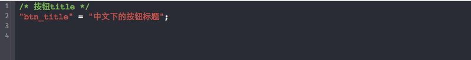
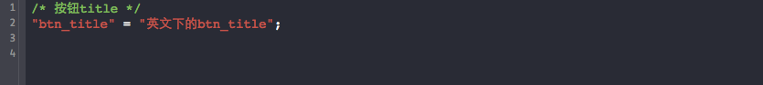

# BQLocalizableStringExample
iOS App 利用NSLocalizedString 实现文本本地化Example


## Example说明

* 在需要本地化的文本用NSLocalizedString替换, 本例中做如下修改：

原代码：

```bash
button.titleLabel.text = @"btn_title";
```
改为：
```bash
button.titileLabel.text = NSLocalizedString(@"btn_title",@"按钮title");
```

当所有需要本地化的文本都修改好之后，还需要进行以下步骤：

* **启动终端，进入工程所在的目录**

* **新建两个目录，推荐放在<font size="3px" color="#ff0000">资源目录</font>下**

>目录名会作用到Localizable.strings文件对应的语言，不能写错了。这里zh-Hans指简体中文，注意不能用zh.lproj表示。

```bash
mkdir zh-Hans.lproj
mkdir en.lproj
```

* **生成Localizable.strings文件**

```bash
genstrings -o zh-Hans.lproj *.m
genstrings -o en.lproj *.m

```
> -o<文件夹>，指定生成的Localizable.strings文件放置的目录

> *.m，扫描所有的.m文件，这里支持的文件还包括.h,.java等

* **右键点击工程的Resources目录，选择“New group”,添加两个目录zh-Hans.lproj和en.lproj**

* **在新建的group中添加刚刚生成的Loclizable.strings文件**

* **最后在Localizable.strings文件中，修改每个key所对应的内容，就可以了。**

中英文下的Localizable.strings 的截图：






更多内容，请移步博客:[http://bingqihuang.github.io](http://bingqihuang.github.io/2015/08/28/genstring%E5%92%8CNSLocalizedString%E5%AE%9E%E7%8E%B0App%E6%96%87%E6%9C%AC%E7%9A%84%E6%9C%AC%E5%9C%B0%E5%8C%96/)